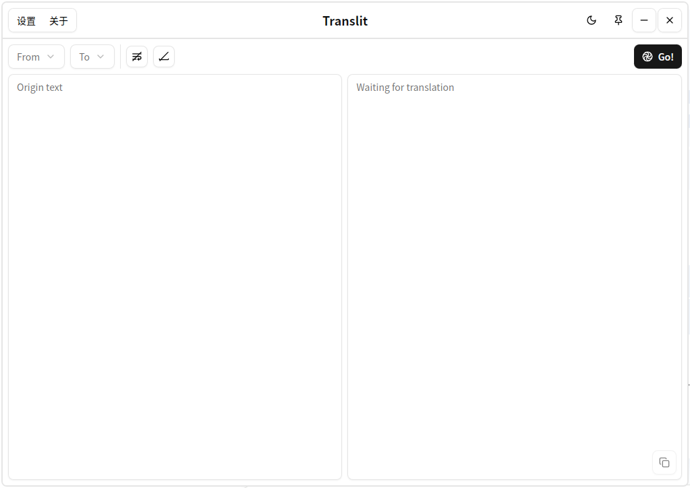
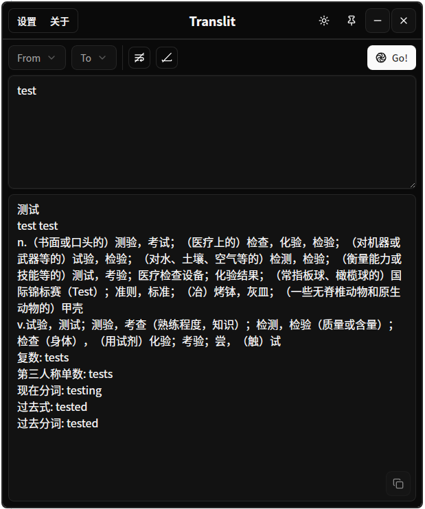
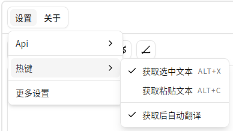

## Translit

翻译软件，基本为liunx设计，测试环境ubuntu22，低于此版本无法运行

## 下载

- [GitHub Releases](https://github.com/fanickee/Translit/releases)

## 应用截图





## 快捷键



获取选文本依赖xclip，需要手动安装

```bash
sudo apt install xclip
```

## TODO

- [ ] ocr识别接口
- [ ] 更多的自定义翻译接口